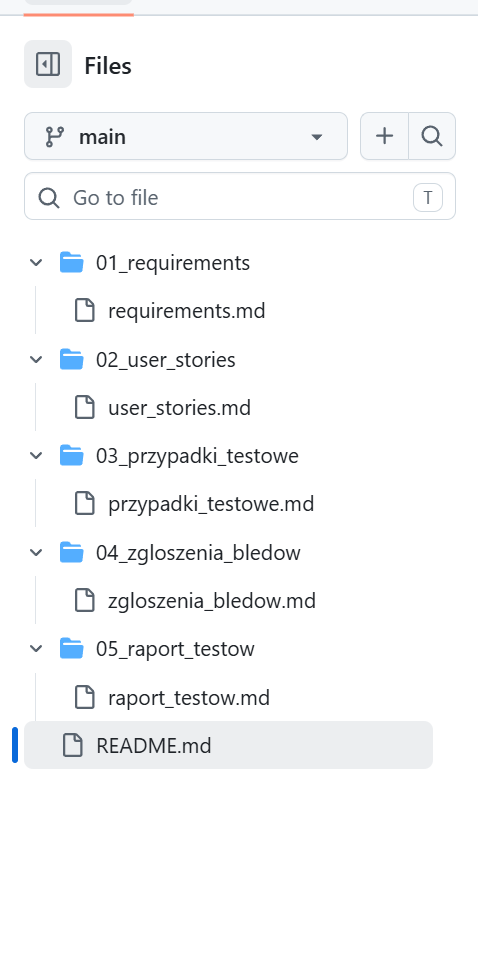
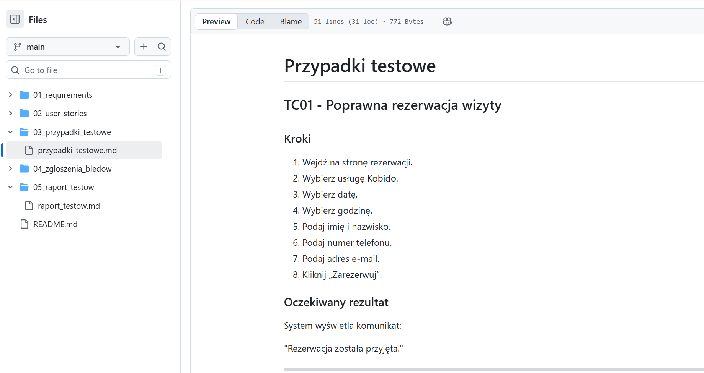
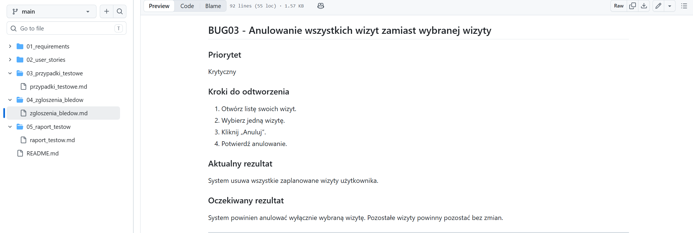
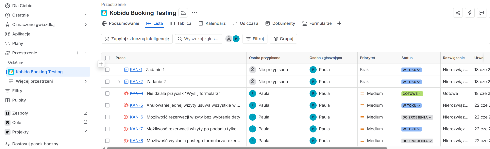

# QA Portfolio - KobidoBooking

Projekt stworzony w celu nauki testowania oprogramowania oraz budowy portfolio QA.

## Zakres projektu

Projekt zawiera kompletną dokumentację testową dla przykładowej aplikacji do rezerwacji wizyt w salonie masażu Kobido.

## Zawartość repozytorium

### 01_wymagania
Dokument wymagań funkcjonalnych aplikacji.

### 02_historie_użytkowników
User Stories opisujące potrzeby użytkowników.

### 03_przypadki_testowe
Przykładowe scenariusze testowe.

### 04_zgloszenia_bledow
Przykładowe zgłoszenia błędów (Bug Reports).

### 05_raport_testow
Raport z wykonanych testów.

## Technologie i narzędzia

- GitHub
- Markdown
- QA Manual Testing

## Autor

Paula Antonowicz-Bielak

## Screenshots

### Repository Structure

### Test Cases

### Bug Reports

### Jira - List View

### Jira - Kanban Board

