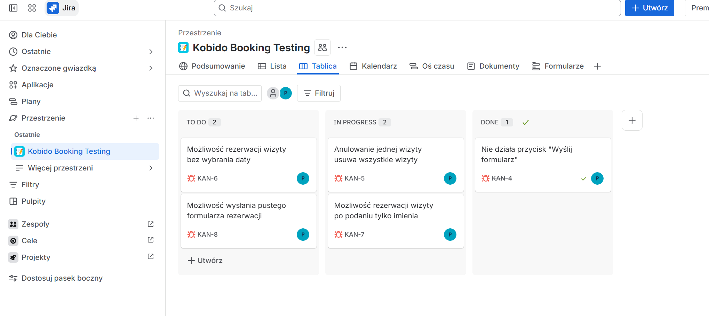

# QA Portfolio - KobidoBooking

Projekt stworzony w celu nauki testowania oprogramowania oraz budowy portfolio QA.

## Zakres projektu

Projekt zawiera kompletną dokumentację testową dla przykładowej aplikacji do rezerwacji wizyt w salonie masażu Kobido.

## Zawartość repozytorium

### 01_wymagania
Dokument wymagań funkcjonalnych aplikacji.

### 02_historie_użytkowników
User Stories opisujące potrzeby użytkowników.

### 03_przypadki_testowe
Przykładowe scenariusze testowe.

### 04_zgloszenia_bledow
Przykładowe zgłoszenia błędów (Bug Reports).

### 05_raport_testow
Raport z wykonanych testów.

## Technologie i narzędzia

- GitHub
- Markdown
- QA Manual Testing

## Umiejętności

- Analiza wymagań funkcjonalnych
- Tworzenie User Stories
- Projektowanie przypadków testowych
- Raportowanie błędów (Bug Reports)
- Testowanie manualne aplikacji webowych
- Dokumentowanie wyników testów
- Zarządzanie zadaniami w Jira
- Praca z GitHub
- Tworzenie dokumentacji w Markdown

## Screenshots

### Repository Structure

### Test Cases

### Bug Reports

### Jira - List View

## Wyniki testów

### Podsumowanie

- Liczba przygotowanych przypadków testowych: 5
- Liczba wykonanych testów: 5
- Liczba wykrytych błędów: 3

### Zidentyfikowane błędy

| ID | Opis | Priorytet |
|----|-------|-----------|
| BUG01 | Możliwość wysłania pustego formularza | Medium |
| BUG02 | Możliwość rezerwacji wizyty bez wyboru daty | Medium |
| BUG03 | Anulowanie wszystkich wizyt zamiast wybranej wizyty | Krytyczny |

### Jira - Kanban Board

## Autor

Paula Antonowicz-Bielak
